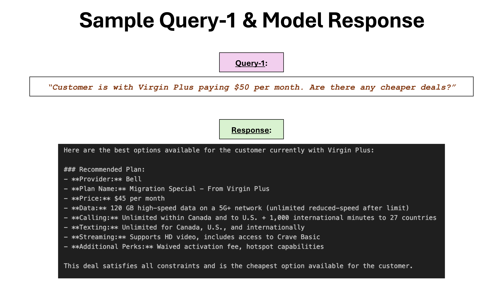
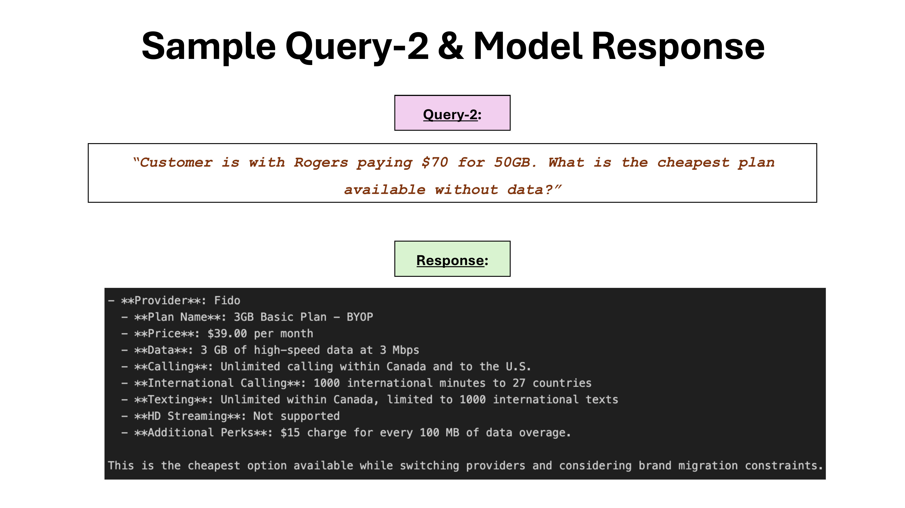
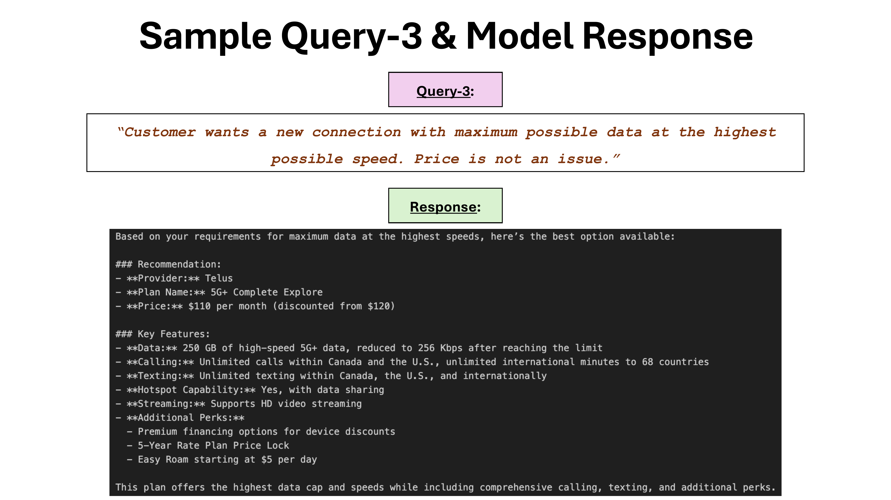
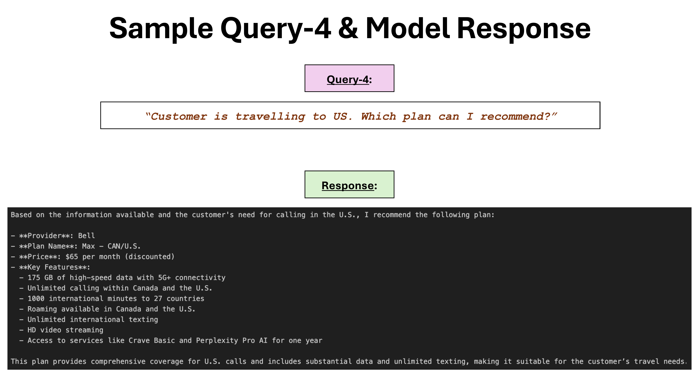
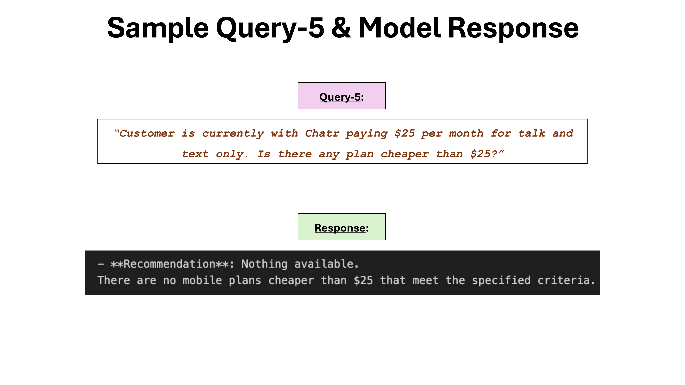

# Smart Best Buy Mobile Advisor (POC)

This repository is a proof of concept (POC) for a **Generative AI–powered assistant** that helps Best Buy advisors quickly recommend the best cellphone plans to customers based on their current provider, spending, and preferences.

The goal is to **reduce advisor lookup time** and **improve plan recommendation accuracy** by combining structured plan data, embeddings, and retrieval-augmented generation (RAG) with OpenAI models.

---

## How It Works

The system uses:

* **Preprocessing** to normalize and describe mobile plan data
* **ChromaDB** as a vector store for embedding and retrieval
* **RAG (Retrieval-Augmented Generation)** with OpenAI’s GPT model to generate contextual, provider-specific responses

---

## Data Sources

The mobile plan dataset was built using publicly available plan information from:

- [Bell](https://www.bell.ca/Mobility/Cell_phone_plans)  
- [Rogers](https://www.rogers.com/plans)  
- [Telus](https://www.telus.com/en/mobility/plans?filter=Hardware)  
- [Fido](https://www.fido.ca/phones/bring-your-own-device?icid=F_WIR_CNV_GRM6LG&flowType=byod)  
- [Virgin Plus](https://www.virginplus.ca/en/plans/postpaid.html)  
- [Koodo Mobile](https://www.koodomobile.com/en/rate-plans?INTCMP=KMNew_NavMenu_Shop_Plans)  

**Note:** Brand migration plans are synthetic examples created for demonstration purposes and do not reflect actual offers.

---

## Project Structure
```
├── data/                         # JSON/JSONL plan data
├── chromadb/                     # Persistent ChromaDB storage
├── preprocessing.ipynb           # Clean, flatten, and convert plan data to text
├── chromadb_manager.ipynb        # Create ChromaDB collections and index plans
├── rag_query_engine.ipynb        # Run RAG + LLM for advisor recommendations
├── .env                          # OpenAI API key
├── .gitignore
└── README.md
```

---

## Quick Start Guide

### Prerequisites
All dependencies are listed in `requirements.txt`.

### Installation
```bash
git clone https://github.com/AkhlaqurRahmanSabby/Best-Buy-GenAI-Advisor
cd Best-Buy-GenAI-Advisor
pip install -r requirements.txt
```

---

## Workflow

Run the notebooks in the following order:

1. **`preprocessing.ipynb`** → Cleans, flattens, and generates natural-language text for all plans
2. **`chromadb_manager.ipynb`** → Creates a ChromaDB and indexes plan + migration data
3. **`rag_query_engine.ipynb`** → Runs the retrieval and LLM-powered recommendation engine

---

## Workflow Overview


---

## Sample Queries and Responses

Below are example screenshots showcasing query–response pairs generated by the system:

1. 
2. 
3. 
4. 
5. 
